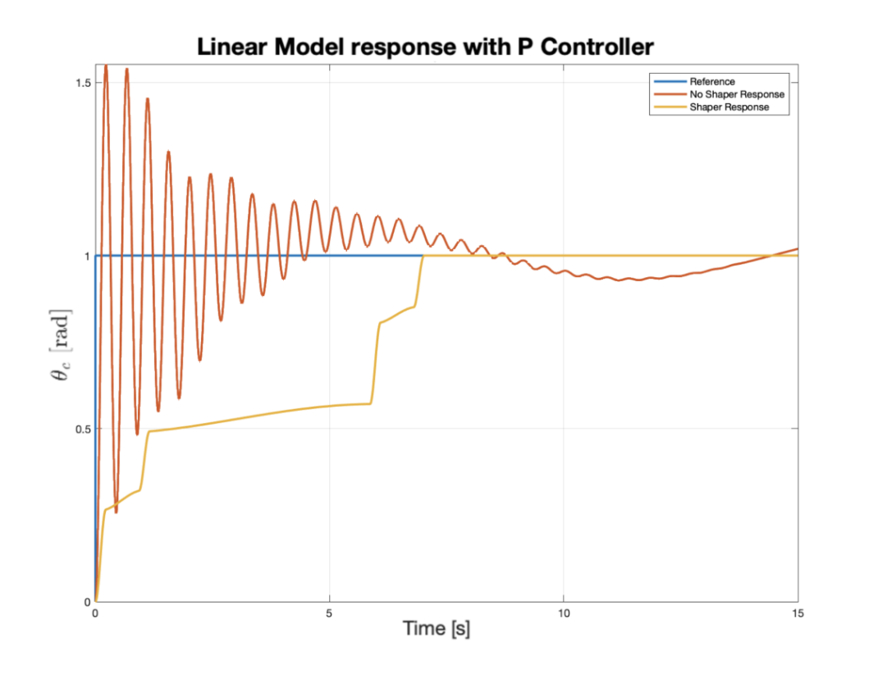
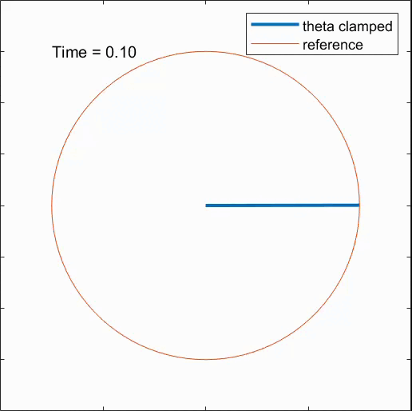
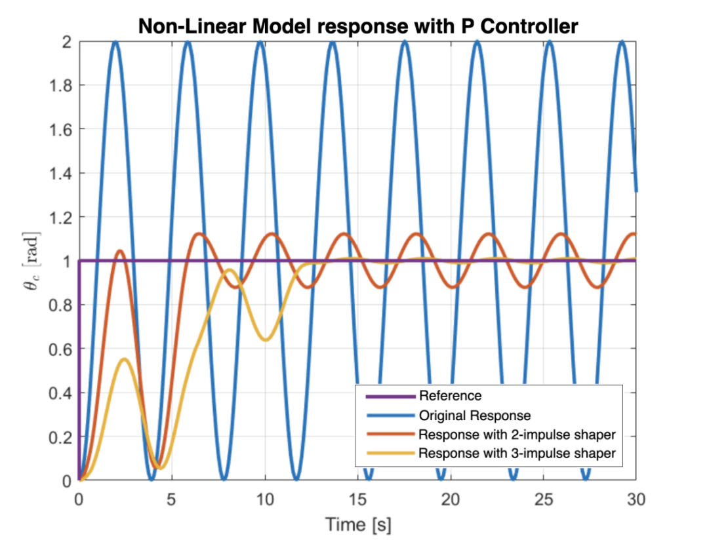
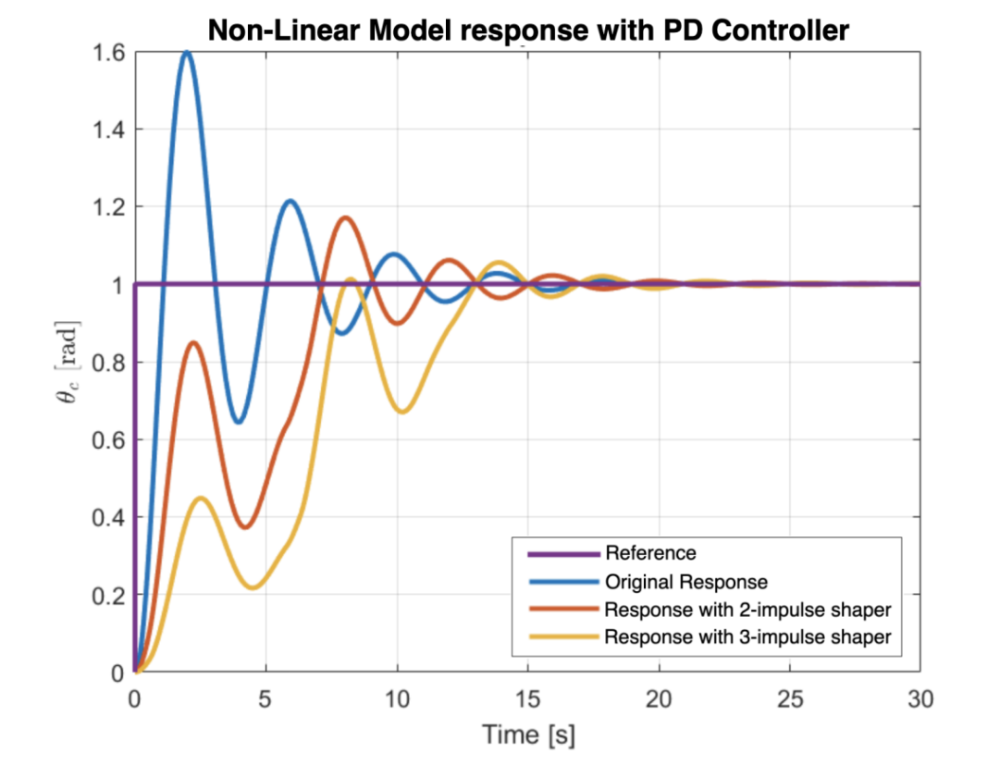

Reducing undesired vibrations is essential for the effective control of robotic manipulators.

This project implements the **Input Shaping Technique** for vibration reduction, as proposed by **Singer and Seering**. The method suppresses residual vibrations by reshaping the reference command, at the cost of an increased execution time.

A **one-link flexible arm** is considered, accounting for both **linear and nonlinear** vibration effects.

Case of linear vibrations:
<table align="center">
  <tr>
    <td align="center">
       
       Regulation task, baseline 
    </td>
    <td align="center">
       
      Regulation task with input shaping 
    </td>
  </tr>
</table>

Case of nonlinear vibrations: 

<table align="center">
  <tr>
    <td align="center">
       
       Regulation task, baseline 
    </td>
    <td align="center">
       
      Regulation task with input shaping 
    </td>
  </tr>
</table>

<table align="center">
  <tr>
    <td align="center">
       
    </td>
    <td align="center">
       
    </td>
  </tr>
</table>
