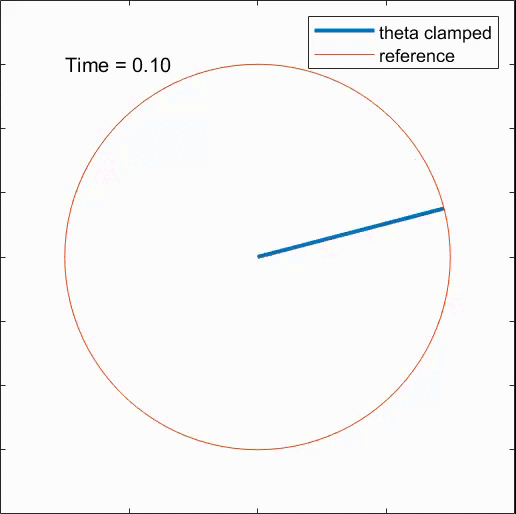
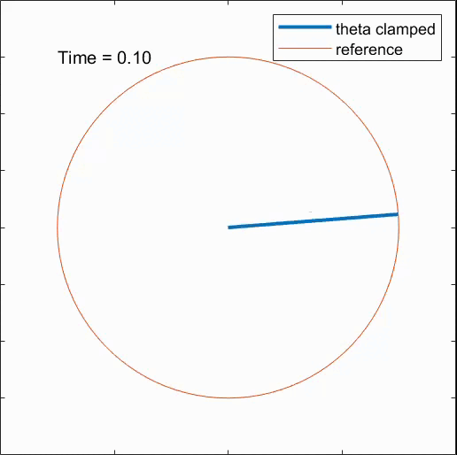

Reducing undesired vibrations is a fundamental aspect for effective control of robot manipulators.

The project consists in the implementation of the Input
Shaping Technique for vibration reduction proposed by Singer and Seering.

A one-link flexible arm is considered for linear and non-linear vibration effects. 

  
  

<table align="center">
  <tr>
    <td align="center">
       
       Regulation task, baseline 
    </td>
    <td align="center">
       
      Regulation task with input shaping 
    </td>
  </tr>
</table>
